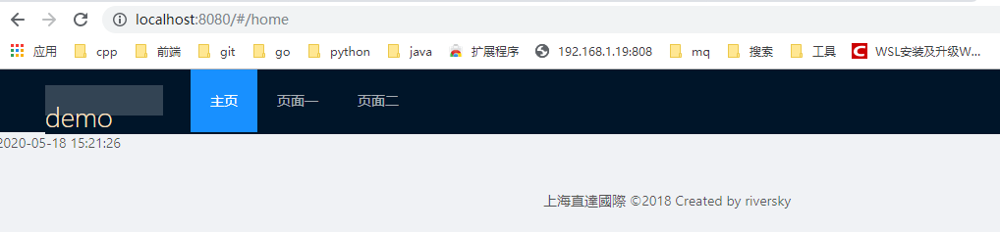

# vue基本脚手架
适合react迁移过来的   

> 基本开发模板

## Build Setup

``` bash
# install dependencies
npm install

# serve with hot reload at localhost:8080
npm run dev

# build for production with minification
npm run build

# build for production and view the bundle analyzer report
npm run build --report
```

For a detailed explanation on how things work, check out the [guide](http://vuejs-templates.github.io/webpack/) and [docs for vue-loader](http://vuejs.github.io/vue-loader).
## 技术栈
```
"ant-design-vue": "^1.4.9",
"axios": "^0.19.0",
"echarts": "^4.5.0",
"mobx": "^4.15.4",
"mobx-vue": "^2.0.10",
"moment": "^2.25.3",
"vue": "^2.5.2",
"vue-class-component": "^7.2.3",
"vue-echarts": "^4.1.0",
"vue-router": "^3.1.3"
```
## 基本效果
